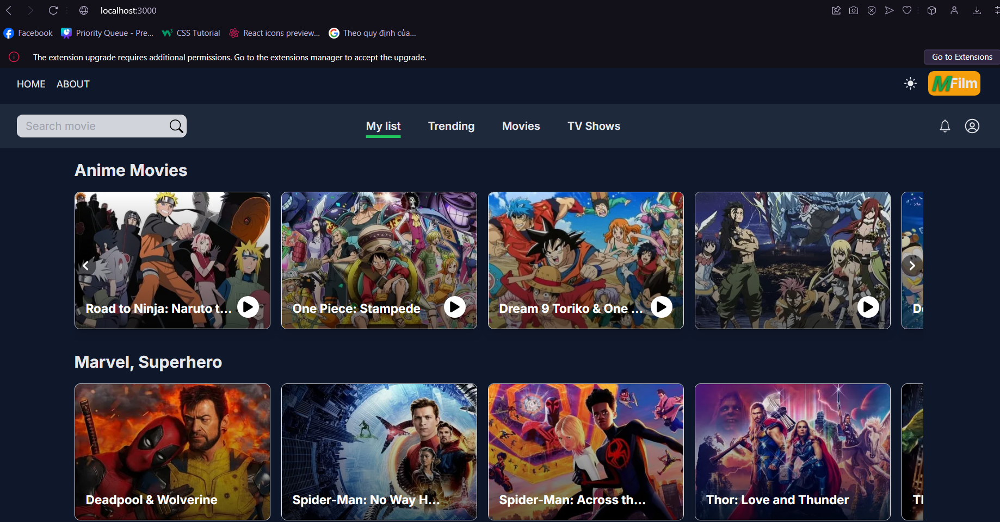
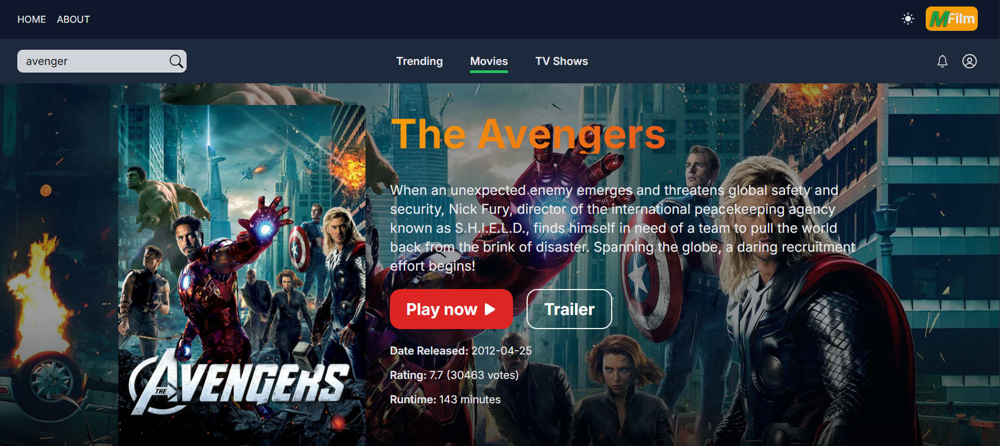
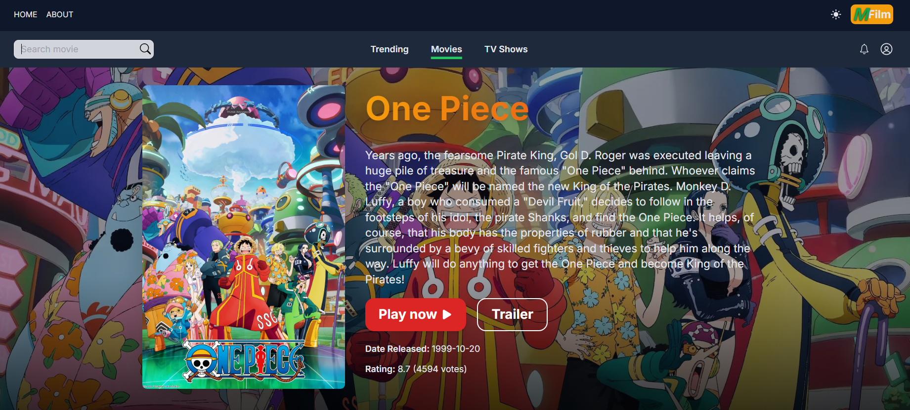
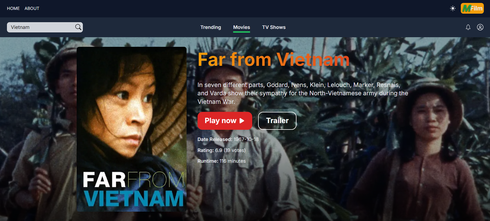
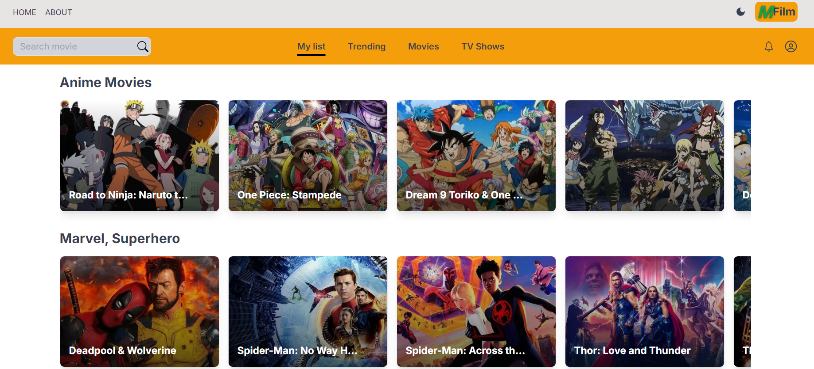

<h1>🍿 Movie App</h1>
<p>This repository contains the frontend code for a movie viewing system. The application is designed to provide a user-friendly interface for easy operation to search for favorite movies and experience.</p>



This is a [Next.js](https://nextjs.org/) project bootstrapped with [`create-next-app`](https://github.com/vercel/next.js/tree/canary/packages/create-next-app).

## 📑 Table of Contents
- [Demo](#demo)
- [Screenshots](#screenshots)
- [Features](#features)
- [Tech Stack](#tech-stack)
- [Getting Started](#getting-started)
- [Learn More](#learn-more)
- [Reference](#reference)


## Demo
<div>You can check out the live demo of the application <a href="https://movie-qdovlavje-loylps-projects.vercel.app/?genre=mylist">here</a>.</div>
<div>(Please make sure to use VPN UIT before accessing.)</div>

## Screenshots

#### Function Search






#### Light Mode


## Features

<table>
  <tbody>
    <tr>
      <td><strong>Search Movies:</strong> Users can easily search for their favorite movies within the application.</td>
    </tr>
    <tr>
      <td><strong>Detailed Movie Information: </strong> Access to view comprehensive information about a selected movie.</td>
    </tr>
  </tbody>
</table>

## 💻Tech Stack
    

## Getting Started

Installation

```bash
# 1. Clone the repository:
git clone https://github.com/LoylP/movie-app.git
# 2. Navigate to the project directory:
cd movie-app
# 3. Install dependencies:
npm i
# 4. Start system:
npm run dev
```
```bash
# Note: To use the movie project, you will need to set up some environment variables on your development machine.
# i. Create a .env.local file in the root of the project.
# ii. Access page "https://www.themoviedb.org" get api movie
# iii. Add the following variables to the .env file, replacing the placeholder values with your own:

    NEXT_PUBLIC_API_KEY="your_api_key"
    NEXT_PUBLIC_API_TOKEN="your_api_token"
```

Open [http://localhost:3000](http://localhost:3000) with your browser to see the result.

You can start editing the page by modifying `app/page.tsx`. The page auto-updates as you edit the file.

This project uses [`next/font`](https://nextjs.org/docs/basic-features/font-optimization) to automatically optimize and load Inter, a custom Google Font.

## Learn More

To learn more about Next.js, take a look at the following resources:

- [Next.js Documentation](https://nextjs.org/docs) - learn about Next.js features and API.
- [Learn Next.js](https://nextjs.org/learn) - an interactive Next.js tutorial.

You can check out [the Next.js GitHub repository](https://github.com/vercel/next.js/) - your feedback and contributions are welcome!

## Reference
-  https://github.com/sahandghavidel/imdb-next
